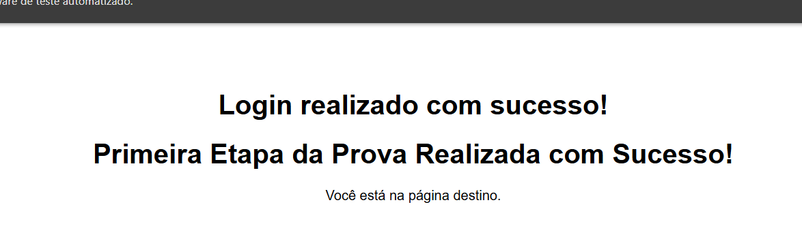

# Prova Teste de Software
DUPLA: GABRIEL DE MELO TIZZIANI E GUSTAVO MARTINS DOS REIS

1. IMPLEMENTAÇÃO TESTE NODE

	Para a realização desse teste, foi iniciado o npn com ‘npm init -y’. Posteriormente foram adicionadas as dependências do webdriver com ‘npm install selenium-webdriver chromedriver mocha fs’. O código foi implementado e foram corrigidas as dependências no json.

Para realizar o teste, foi necessário executar o arquivo com node prova.test.js, e assim, foi possível visualizar o processo de login sendo realizado com sucesso.
Todo o código foi comentado explicando o que foi realizado em cada linha e bloco de código.

É possível visualizar o código realizado no teste por no github: https://github.com/gustavoreiis/Prova_Teste

2. IMPLEMENTAÇÃO DOS TESTES COM PYTHON

	O documento para a implementação em Python foi criado, juntamente com a instalação do arquivo venv que é necessário para a execução dos testes com selenium em Python. Foi realizada a adição do código que executa os testes, juntamente com a explicação das etapas realizadas no código.

3. Explique como o Selenium funciona para Python e NodeJS
   
Em Python, o Selenium é usado por meio da biblioteca selenium, onde você pode criar um driver (geralmente do Chrome ou Firefox) com webdriver, localizar elementos com métodos como find_element() e interagir com eles (clicar, enviar texto, etc.). Por exemplo, para abrir uma página, você usa driver.get("url").
Já em Node.js, o Selenium é usado via o pacote selenium-webdriver, com uma estrutura muito parecida: você cria um driver, acessa a página e interage com elementos. O código geralmente é assíncrono, usando async/await com funções como driver.get(), driver.findElement() e element.click().

4. TESTES REALIZADOS COM JMETER
   
Coloquei um grupo de usuários com 5, com 250 de iteração, ao iniciar o teste já foi possível visualizar na tabela que o site (https://www.hankeds.com.br/prova/login2.html) já estava sobrecarregado, consequentemente está fora do ar.

Teste realizado no site https://jaguapita.pr.gov.br/, aqui podemos ver que com o mesmo grupo e iteração o teste passou positivo.

